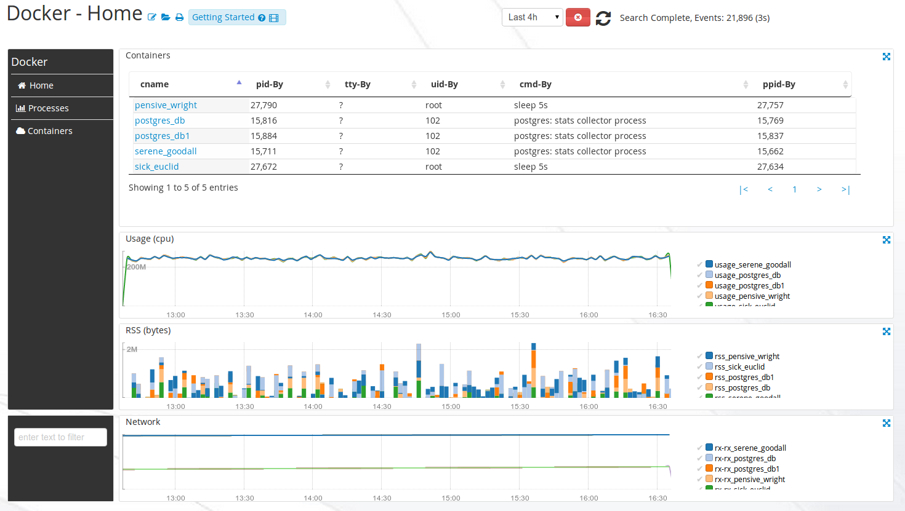
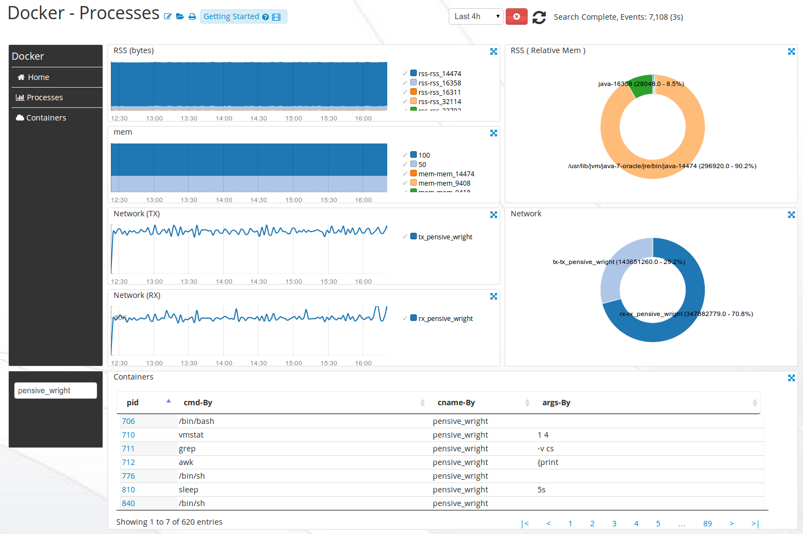
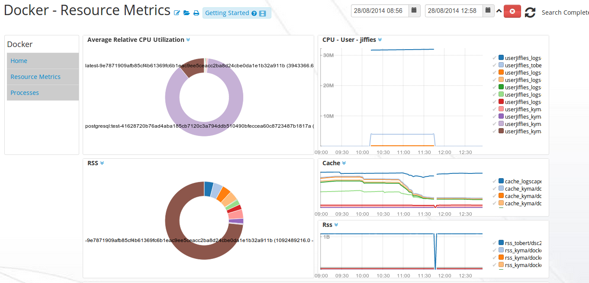
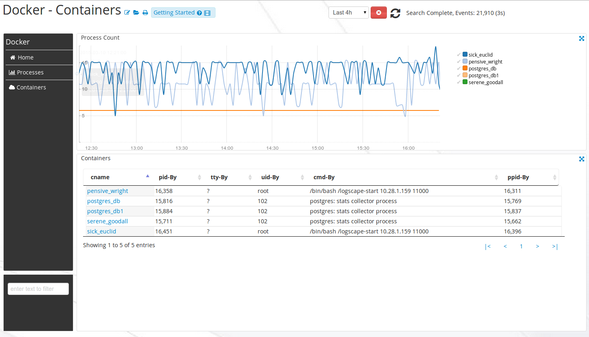

# DockerApp-1.0

# Intro 

Monitor resources of a  Docker host, its containers, and the processes that each container runs. Identify outliers and create alerts for your docker images and containers. 
The Docker App gives you visibility of your Docker Containers, the processes running in them and their resource utilization. 

## Downloads 

 * [DockerApp-1.1.zip](https://github.com/logscape/DockerApp/raw/master/dist/Docker-1.1.zip)
 * [DockerApp-1.1-override.properties](https://github.com/logscape/dockerapp/raw/master/DockerApp-1.1-override.properties) 

## Configure 

You can run the DockerApp on the same host as your Docker host by using a resource selector. This query 

	bundle.defaults.resourceSelection=hostName containsAny DockerHost 

will select all Forwarders which have the DockerHost substring in them and execute the DockerApp.

## Containers

The Home Workspace displays overall container resource utilisation, cpu,memory and network utilisation are display as line charts. 

 

## Processes Metrics 

The Processes Workspace displays the Network, Memory and CPU utilization for all your Docker containers. Clicking on a process id will filter the Workspace to display just that process. 

 

## Resources 
 

## Containers 

 

