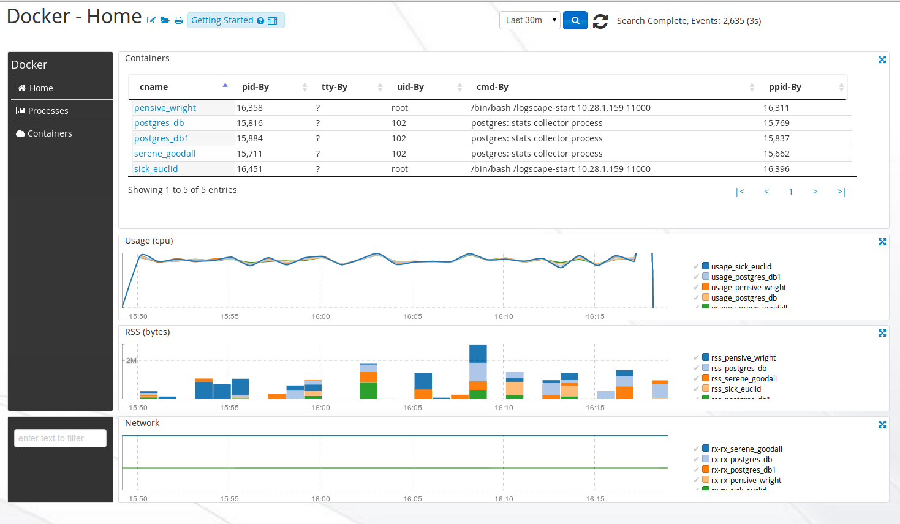

# DockerApp-1.0

# Intro 

The Docker App gives you visibility of your Docker Containers, the processes running in them and their resource utilization. Use the DockerApp to get operational visibility of multple docker containers running on the same host. 

## Downloads 

 * [DockerApp-1.1.zip](https://github.com/logscape/DockerApp/raw/master/dist/DockerApp-1.1.zip)
 * [DockerApp-1.1-override.properties](https://github.com/logscape/dockerapp/raw/master/DockerApp-1.1-override.properties) 

## Configure 

Use a resource selection query to specifiy which Forwarder your DockerApp is going to run. The Logscape Forwarder must be installed on the same host as the Docker daemon.
This following resource query example will run on any Forwarder 

	bundle.defaults.resourceSelection=hostName containsAny DockerHost 

containing the DockerHost substring in them and execute the DockerApp.

## Home

The Home Workspace displays overall container resource utilisation, cpu,memory and network utilisation are display as line charts. 

 

## Processes Metrics 

The Processes Workspace displays the Network, Memory and CPU utilization for all your Docker containers. Clicking on a process id will filter the Workspace to display just that process. 

 

## Resource
The Resources Workspace provides a container wide view of cpu,memory and network utilisation. 

 

## Containers 

The Containers Workspaces gives a view of process activity in running containers. 

 

